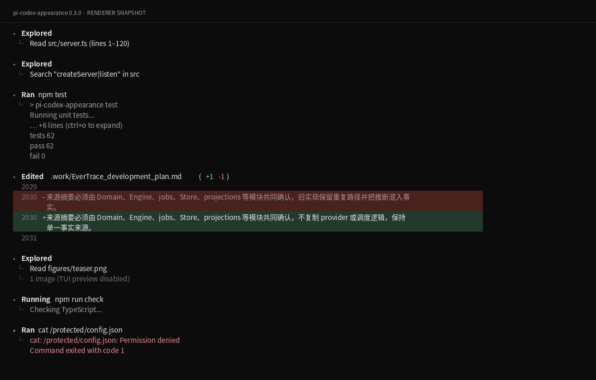

# pi-codex-appearance

**默认启用的 Codex 风格工具转录界面。** 安装后，Pi 原生工具使用紧凑工具行、运行状态、探索记录、折叠输出与 diff 预览。模型、工具执行与上下文处理保持原有路径。

版本：**0.3.0**。面向用户当前使用的 classic Pi **0.85.1** 接口。0.3.0 重点重写 `edit` diff：按 Codex 当前暗色 TUI 的行号/符号顺序、整行背景、长行悬挂缩进和完整 context-window 呈现。



上图由 `src/renderers.ts` 的同一 diff layout 函数生成 ANSI 文本，再渲染到 HTML。0.3.0 的预览包含整行 diff 背景和悬挂缩进；它仍不是完整 Pi 或用户全部插件的联合实测。

## 默认显示

```text
• Explored
  └ Read src/server.ts (lines 1–120)

• Ran npm test
  └ Running unit tests...
    … +24 lines (ctrl+o to expand)
    tests passed

• Edited src/server.ts (+2 -1)
  12  export function startServer() {
  13 -  server.listen(3000);        ← muted red full-row surface
  13 +  const port = Number(...);   ← muted green full-row surface
  14 +  server.listen(port);        ← muted green full-row surface
  15  }
```

- **命令执行**：`Running → Ran`，命令高亮，续行 `│`，结果 `└`。运行中显示最新输出，完成后保留首尾预览，错误前景标红。
- **文件探索**：`read/grep/find/ls` 使用 `Exploring → Explored` 与动作摘要。成功输出默认折叠；点击工具行或使用 Pi 当前的工具展开快捷键可查看所有文本块。快捷键提示来自 Pi，自定义键位不会被覆盖。
- **文件修改**：`edit` 采用 Codex 式 `行号 + 空格 + +/- + 内容`：删除行整行背景 `#4A221D`，新增行整行背景 `#213A2B`；换行后内容悬挂对齐到正文列，context 行无背景，Pi 自带的 compact context window 不再二次截断。`write` 仍提供带行号的写入内容预览。
- **图像结果**：保留 Pi 原生图片显示路径，服从 `terminal.showImages`。关闭图片预览时显示轻量图片数量提示，不输出 Base64。
- **配色**：中性文字、灰色层次、红绿 diff 和错误色；主题不强制终端背景色。

每个工具调用保留独立的显示与展开状态，不跨调用合并结果。连续探索不会完全复现 Codex 的跨调用聚合。输入框、页脚、Working line、思考块、审批流程和快捷键沿用现有插件；本项目没有复制另一套完整终端客户端。

## 本地安装

解压本版本压缩包，然后执行：

```bash
pi install /绝对路径/pi-codex-appearance
```

重新启动 Pi。**紧凑转录布局默认生效，无需另行启用 optional 扩展。**

在 `/settings` 选择 `codex-appearance` 可同时应用中性配色。也可以只修改现有 `~/.pi/agent/settings.json` 的这个字段，保留其他内容：

```json
"theme": "codex-appearance"
```

原生工具采用 self-shell，因此即便仍使用原有 `dark` 主题，也会移除这些工具的外层卡片。第三方工具自带的布局继续保留；配套主题可以统一使用主题 token 的背景色，但不会强行覆盖插件硬编码的颜色。

若已经安装上游 `pi-codex-style-tools`，先移除上游包，避免它继续注册同名工具及改写搜索结果。移除旧包后重新启动。0.1.0 用户应移除自己额外添加的 `optional/format-tools.ts` 条目；0.2.0/0.3.0 都自动加载 `index.ts`。

## 与现有插件的边界

工具来源通过 Pi 的 `sourceInfo` 核对。**只有明确来自 Pi 内建实现的工具会使用新的 renderer。** FFF/LSP 等插件即便覆盖相同的 `read/grep/find/edit` 名称，也会保留其 renderer。

| 已有功能/插件 | 本项目的处理 |
| --- | --- |
| FFF、LSP 的同名工具覆盖 | 保留来源为扩展的工具定义、执行函数与 renderer |
| `pi-codex-conversion` 的结构化工具 | 不接管 `exec_command/apply_patch/...` |
| Web、MCP、session recall、subagent、询问工具 | 不注册对应工具，不改写其搜索内容或结果 |
| RTK、condense、contextPrune | 不监听 `tool_call/tool_result/context/before_agent_start` |
| `pi-zentui` | 保留 editor、footer、Working line；不增加第二套计时器 |
| `pi-copy-soft-wrap` 与思考快捷键 | 不改 TUI 根渲染器、终端输出、复制接口、思考块或快捷键 |

这些结论描述代码边界与契约测试范围。没有在用户的整套已安装插件实例上完成联合运行，不能据此宣称任意版本的任意插件都零冲突。

## 实现与退避

扩展没有 `registerTool()`，不重新创建内建工具，不修改工具参数、执行结果、会话记录、模型上下文或系统提示词。上游的 `compactSearchResult` 与全局结果改写已删除。

针对已核对的 Pi 0.85.1 UI，扩展装饰 `ToolExecutionComponent` 的三个 renderer/shell selector 以及这个**工具行组件自身**的 `render()`。默认构造的子组件树保持不变；首次实际绘制时切换 self-shell 并填充显示内容。这使卸载后可以还原原有卡片，不需要剪切 children，也不改写鼠标命中或图片协议。

以下情况会退避：已有 selector/render patch、接口形状未知、来源不明、第三方自渲染工具、原型不可修改。启动时会给出警告，说明紧凑转录没有安装；不会默默宣称已启用。后来插件修改同一接口时，本项目退回原有 selector，并在卸载时避免覆盖后来者。内部 UI 接口未来仍可能变化，详见 [兼容性说明](docs/compatibility.md)。

## 测试与预览

无需调用模型的核心检查：

```bash
npm test
npm run check:core
npm run preview
```

完整宿主检查需要 Node.js **>=22.19.0** 和真实 Pi 依赖：

```bash
npm install --ignore-scripts --no-audit --no-fund
npm run verify
```

`test:host` 使用真正的 Pi `ToolExecutionComponent`，不以 mock 包替代依赖。当前交付环境未能下载该依赖；完整宿主检查及完整插件联合运行仍未验证。已经执行的检查、失败项目与环境记录见 [VALIDATION.md](VALIDATION.md)。

## 创建 GitHub 仓库并推送

本交付未执行远端建库或推送。在已有 GitHub CLI 登录的本地环境，进入刚解压的源码目录执行：

```bash
bash scripts/publish-github.sh
```

脚本验证账号为 `Rycen7822`，创建新的**私有** `pi-codex-appearance` 仓库并推送。它拒绝已有远端仓库及已有本地 Git 仓库，采用文件白名单，不收集 Pi 设置、密钥、会话或日志，不请求或嵌入访问令牌。GitHub Actions 文件只进行源码测试，不发布 npm 包。

## 来源与许可

基于用户提供的 `pi-codex-style-master.zip` 修改，保留上游 MIT 许可。来源和归属见 [NOTICE](NOTICE)。本项目与 OpenAI、Pi 上游无官方关联。
